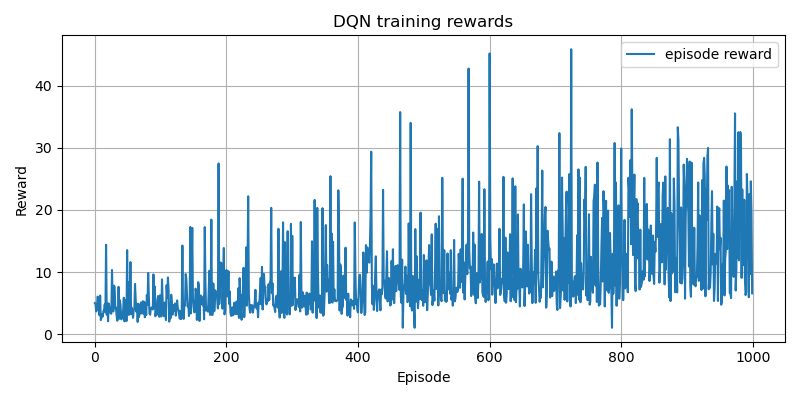
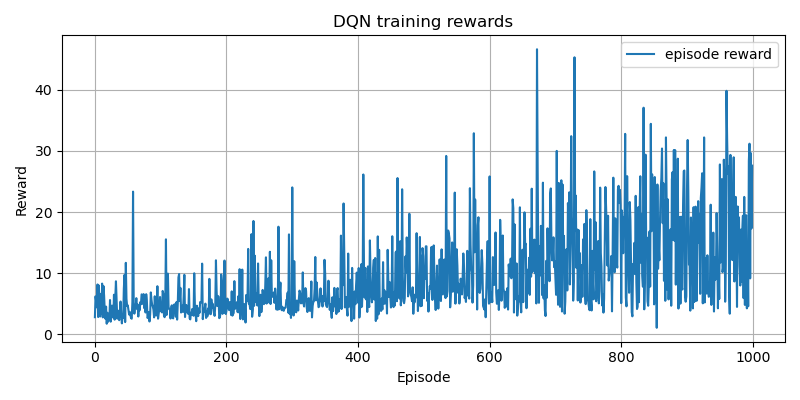

# HOMEWORK 2: DQN 

In this homework a DQN was trained to push an object to a desired end position.

## Important files
 - homework_2v2.py : first implementation -> dqn_highlevel_new_reward.pth
 - homework2_v3.py : second implementation -> dqn_highlevel.pth
 - homework2_test.py: test file (10 random target positions; with visualisation)

## First implementation

The first version can be found in the file homework_2v2. Here first a MLP working with the highlevel state was used for the policy as well as the target net. The target net is only periodically updated to provide a steady target. In this version, the suggested reward function as well as the suggested set of hyperparameters was used. The resulting rewards over episodes is plotted below.

## Second implementation
During testing of the first approach, I noticed that the robot tended to push the object away a lot (probably due to one part of the reward function being the proximitiy of the end effector to the object). To combat this, I added one term to the reward function that rewards the object velocity to be in direction of the target. In this way, the robot pushing the object away from the target is punished. 

The reward over episode plot is shown below.

## Problems
The DQN approach was in neither implementation able to reliably push the object to the target position. The robot struggled with settings where the robot needs to move behind the robot to push it back as this motion does not reward the robot a lot. It managed to learn getting beside the object in the second implementation resulting in less times that the robot pushed the object away. However, it often here did not manage to then get behind the object

Possible solution proposals:
- adding additional actions to the action space (e.g. rotational degree of freedom): This could help to avoid the robot having to move completely around the object to push it in the right direction but moving just beside it and then moving it by rotating.
- adding additional information to the high-level state like the size of the object to combat the robot running into the object